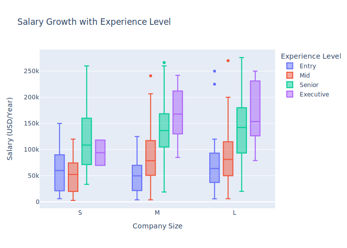
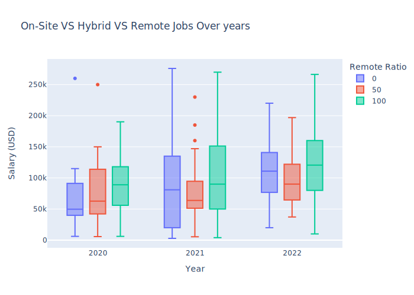
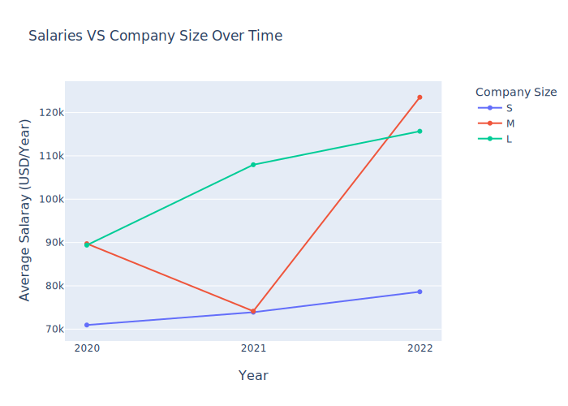

# Data-Science-Salaries

## Overview
### Purpose
The purpose of this project is to study the salaries in the Data Science field and how they relate to location, experience level, and other factors.
### Tools Used
- Python 3.7.11 with Jupyter Notebooks
- Plotly
- Matplotlib
- Seaborn
- NumPy
- Pandas

## Dataset (Data Science Job Salaries)
- Contains data about several jobs in the data science field.
- Source: Kaggle, uploaded by Ruchi Bhatia ([link here](https://www.kaggle.com/datasets/ruchi798/data-science-job-salaries)).
- Originally has 12 columns and 607 rows.

## Key Findings

The most rapid growth in the salary with experience level appears to be in mid-sized companies.

Fully-remote jobs tend to pay higher than on-site and hybrid jobs. The difference seems to slowly increase with time.

Mid-sized companies are the ones affected by the pandemic the most. There appears to be a huge decline in salaries in 2021. What proves that is the rapid recovery in 2022.

## How to View the Project
**Option 1 (recommended):** View the project on Kaggle from [here](https://www.kaggle.com/code/moaazmahmoud1/data-science-salaries?scriptVersionId=102193760).

**Option 2:** To view on GitHub, open [this notebook](notebook_github.ipynb). It uses the Plotly SVG renderer and it renders well on GitHub. The only downside is that the `plotly` plots are not interactive.

**Option 3:** You can also download [this notebook](notebook.ipynb) and run it on Jupyter Lab. This requires the libraries mentioned above. [The `plotly` plots will not render on GitHub.]
